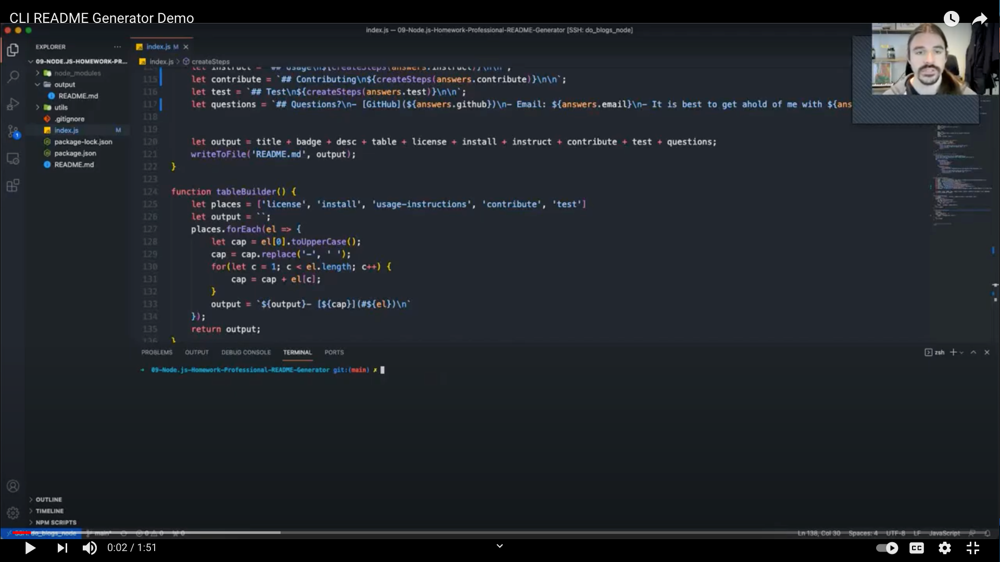

# 09-Node.js-Homework-Professional-README-Generator
  

## Application Demo
[YouTube](https://youtu.be/m7ahttQrLlc)

## Description
A friendly ol' CLI README generator. Build using Node.js

Project Goals:
- Generate README's
- Ask questions with Inquirer
- Write README using FS

## Skills Learned
- [Inquirer](https://www.npmjs.com/package//inquirer)
- [Node.js](https://developer.mozilla.org/en-US/docs/Glossary/Node.js?utm_campaign=feed&utm_medium=rss&utm_source=developer.mozilla.org)

## Resources
- [Node.js Documentation](https://nodejs.org/en/docs/)
- [Inquirer](https://www.npmjs.com/package//inquirer)
- **General Reference ->** [MDN](https://developer.mozilla.org/en-US/)
